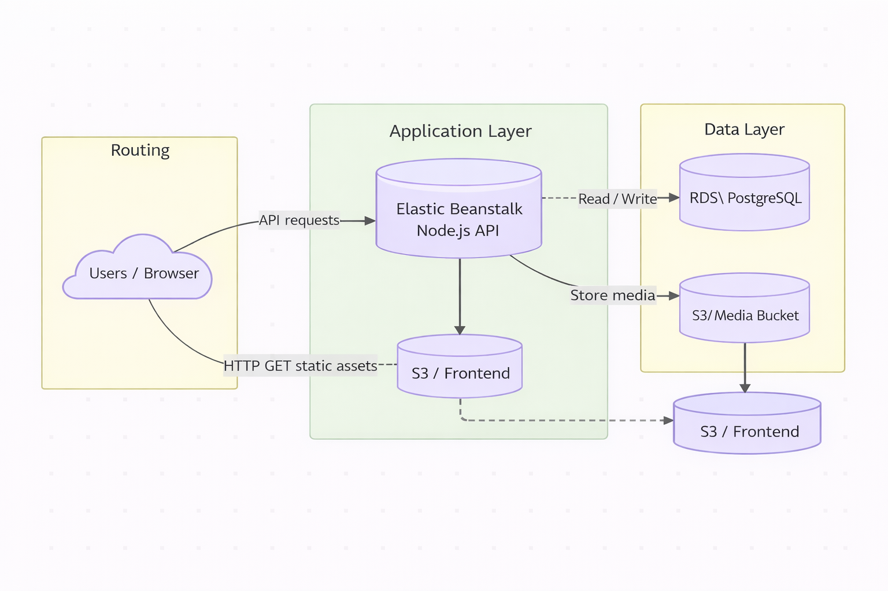

# Infrastructure Overview

This project uses a three-tier architecture deployed on AWS.  
Below is the full description of the infrastructure components.

---

## 1. Frontend Hosting (Static Web Hosting)
### **Amazon S3 Bucket**
- Stores the built Angular frontend.
- Provides static hosting for HTML, CSS, JS assets.
- Public read access enabled through bucket policy.
- Frontend is accessed directly via S3 website endpoint.

---

## 2. Application Layer (Backend API)
### **Elastic Beanstalk (Node.js Environment)**
- Hosts the Node.js API server.
- Handles auto-scaling, load balancing, and health monitoring.
- Runs the compiled backend (server.js).
- Communicates with S3 and RDS.

---

## 3. Data Layer
### **Amazon RDS – PostgreSQL**
- Managed relational database instance.
- Stores users, feed items, and application data.
- Only accessible by the Elastic Beanstalk security group.

### **Amazon S3 (Media Bucket)**
- Stores user-uploaded media (images).
- API writes and retrieves media objects.

---

## 4. IAM & Security
- IAM roles for EC2/Beanstalk instance access to S3.
- Security groups controlling inbound/outbound traffic.
- Environment variables stored securely inside EB configuration.

---

## 5. High-Level Architecture Diagram
