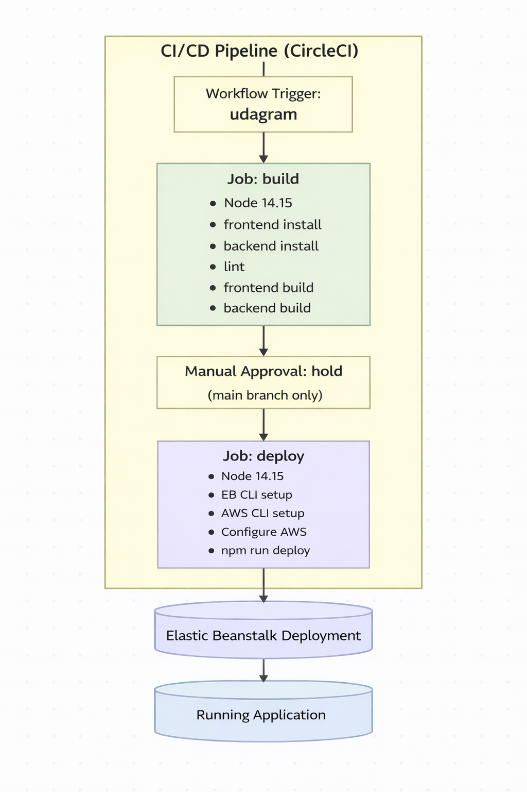

# CI/CD Pipeline Overview

This project uses a CircleCI pipeline to automate build and deployment processes.  
Below is the functional flow of the configured pipeline.

---

## 1. Pipeline Trigger
- Triggered automatically on every commit pushed to GitHub.

---

## 2. Build Stage
### **Frontend Build**
- Install Angular dependencies.
- Lint the code.
- Build the production Angular app.

### **Backend Build**
- Install backend dependencies.
- Build and compile backend project.

---

## 3. Manual Approval Step
- Required only when running on the **main** branch.
- Ensures deployment does not occur automatically.

---

## 4. Deployment Stage
### **Backend Deployment**
- Deploys the backend (Node.js API) to **AWS Elastic Beanstalk**.

### **Frontend Deployment**
- Uploads the generated Angular build artifacts directly to the **S3 static hosting bucket**.

---

## 5. Pipeline Diagram

